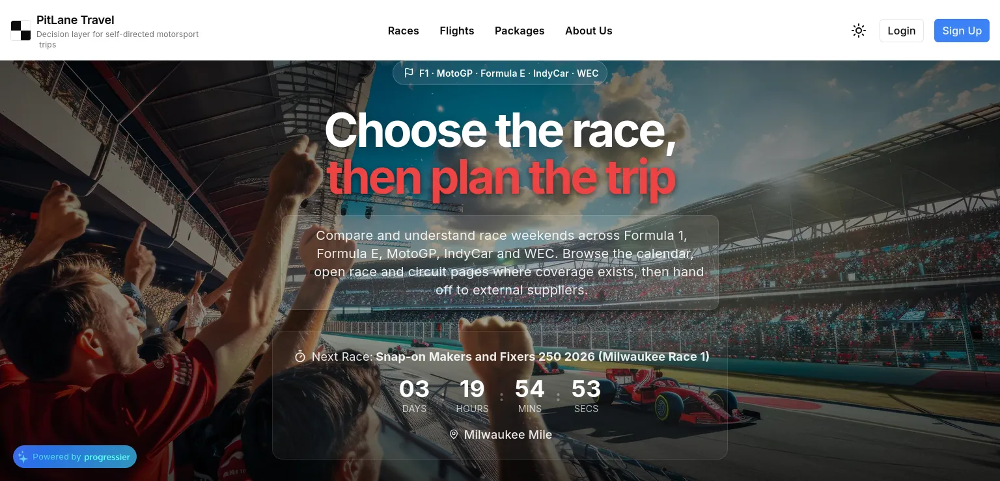
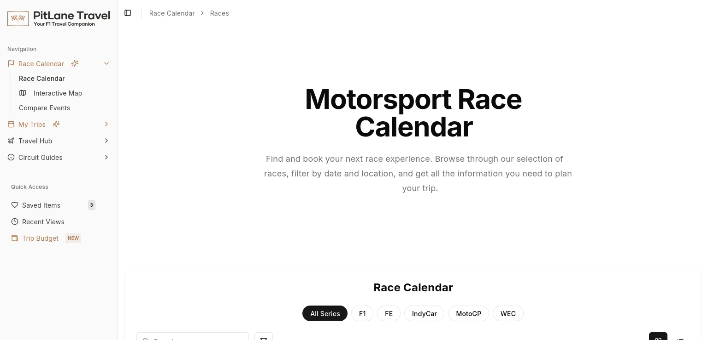
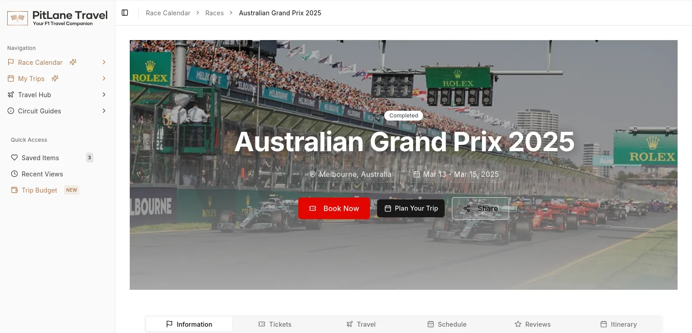

# Production baseline (2026-08-25)

This is the PLT-010 production pin. It is not a health certificate and it is
not a Preview/CI check. Raw anonymous entry status is **not** HTTP 200.

## Pin

| Field | Value | Class |
|---|---|---|
| Baseline timestamp | `2026-08-25T04:17:23.541Z` | Observed (parent `check:public-routes` rerun) |
| Canonical origin | `https://www.pitlanetravel.com` | Observed |
| Production merge SHA | `60a006385784b95d24d2dc167810b25abbd6f45b` | Observed (Vercel / git) |
| Production deployment | `dpl_EM1vopUcU1S7gcz6p3FES6NUde2P` | Observed (READY) |
| Immutable deployment URL | `https://pit-lane-travel-7ed8fzoi4-rickoslyders-projects.vercel.app` | Observed |
| Aliases | `https://www.pitlanetravel.com`, `https://pitlanetravel.com`, `https://pit-lane-travel.vercel.app` | Observed |

## Reproduce

From the repository root, after `npm ci`:

```bash
npm run check:public-routes -- --base-url=https://www.pitlanetravel.com
```

That command is read-only. It GETs `/sitemap.xml`, then GETs each same-origin
`<loc>` with `redirect: "manual"` and `credentials: "omit"`. It does not follow
redirects, does not send cookies or Authorization, and does not authenticate.
Node `fetch` is the HTTP client; `AbortSignal.timeout` bounds each request.

https://nodejs.org/api/globals.html#fetch
https://nodejs.org/api/globals.html#class-abortsignal
https://nodejs.org/api/globals.html#static-method-abortsignaltimeoutdelay

Bounds (also printed in the JSON `bounds` object):

| Bound | Value |
|---|---|
| Sitemap routes | 1–250 unique same-origin https URLs |
| Probe concurrency | 4 |
| Per-route timeout | 10_000 ms |
| Sitemap timeout | 15_000 ms |
| Sitemap body cap | 1_048_576 bytes |
| Redirect recording | origin + pathname only (query, fragment, userinfo stripped) |
| Writes | none |

Sitemap `<urlset>` / `<url>` / `<loc>` parsing follows the Sitemap protocol.
Sitemap indexes are rejected.

https://www.sitemaps.org/protocol.html

Visual routes (browser, after any Clerk handshake the browser completes):

```text
https://www.pitlanetravel.com/
https://www.pitlanetravel.com/races
https://www.pitlanetravel.com/races/australian-grand-prix-2025
```

Control routes:

```text
https://www.pitlanetravel.com/pricing
https://www.pitlanetravel.com/trips
```

## Sitemap and raw entry responses

**Observed** — parent rerun `2026-08-25T04:17:23.541Z` against the pin above.

| Class | Count |
|---|---|
| Unique sitemap routes | 178 |
| static | 14 |
| series | 5 |
| circuit guides | 25 |
| race details | 111 |
| race history | 23 |

Script output summary (do not paste the 178 route records):

- `sitemap_route_count`: 178
- `status_counts`: `{ "307": 178 }`
- `external_redirect_count`: 178
- every recorded `redirect`: `https://main-cod-26.clerk.accounts.dev/v1/client/handshake`
- query and fragment stripped from every recorded Location

This is **not healthy**. It is an actionable production configuration finding:
raw anonymous public GETs are being forced through a Clerk **development-browser
handshake** on `https://main-cod-26.clerk.accounts.dev`. That is an entry-response
measurement. It is not a statement that the HTML app failed to render.

**Distinguish layers**

| Layer | What it measured | Result |
|---|---|---|
| Raw anonymous GET (`check:public-routes`, `redirect: "manual"`) | First HTTP status and sanitized Location | All 178 sitemap routes → HTTP 307 off-origin handshake |
| Camofox browser completion | Page after the handshake | App rendered (see Visual evidence) |

Do not claim every route “renders 200”. The raw entry status is 307.

## Visual evidence

Checked-in assets are libwebp encodes of the Camofox PNGs. Source PNGs were not
modified. Viewport for every asset: **1536×740**.

| Route | Asset | sha256 | Snapshot record |
|---|---|---|---|
| `/` | [evidence/production-baseline-2026-08-25/home.webp](evidence/production-baseline-2026-08-25/home.webp) | `3eeb027383ba7e24578dd9b32ca41f9da425b912944c569477dd06f8db51b2ac` | Populated home; no error wall |
| `/races` | [evidence/production-baseline-2026-08-25/races.webp](evidence/production-baseline-2026-08-25/races.webp) | `46f6a2ba7f1fadf58a992fc7d20c2ebf5257aab14e1ad011df6470edf5823894` | Race calendar rendered; advertised 113 races |
| `/races/australian-grand-prix-2025` | [evidence/production-baseline-2026-08-25/race-detail-australian-2025.webp](evidence/production-baseline-2026-08-25/race-detail-australian-2025.webp) | `51f099a1b5d6d22212c216a609aa970d450f23352e3cd179751c62e2447ab2f9` | Australian GP 2025 event detail rendered |





**Observed visual debt:** the public home header uses the current “Decision layer
for self-directed motorsport trips” identity, while the authenticated-style race
shell still displays “Your F1 Travel Companion”; the home capture also shows the
third-party Progressier badge. The WebPs decode without visible compression
corruption.

**Limitation:** Camofox console capture was unavailable. Do not claim zero JS
console errors. The 113-race figure is from the snapshot record, not from
counting cards in the 1536×740 crop (the crop shows calendar chrome and series
filters).

**Control routes** (browser completion, same session class):

| Route | Outcome |
|---|---|
| `/pricing` | App 404 / Page Not Found (expected after PLT-007) |
| `/trips` | Anonymous navigation → `/login?redirect_url=%2Ftrips` |

## Funnel / event baseline

**Source instrumentation** (what the app can emit). Not live receipts.

- PostHog: `$pageview`, `clicked_get_started`
- GTM: `page_view`, `view_item`, `add_to_wishlist`, `add_to_cart`, `begin_checkout`, `add_payment_info`, `purchase`

**Limitation:** no governed analytics export was available in this run.
Emitted and received totals are unknown and must not be inferred.

**Last read-only app DB snapshot** (earlier in the same Gate-A production
audit; no PII):

| Signal | Value |
|---|---|
| profiles | 1 |
| trips | 1 |
| ticket redirect clicks | 20 |
| tickets | 311 |
| ticket inventory season | 2025 only |
| upcoming 2026 races | 27 |
| upcoming 2026 ticket inventory | 0 |

**Limitation:** a fresh Supabase Management API read was attempted; the current
fine-grained token returned `403 database_read denied`. Treat the table as a
prior read-only snapshot, not a live recount.

## Provider and flag state

**Provider groups configured in production** (names / Vercel metadata types
only; values were not read or recorded):

Supabase/Postgres, Clerk, Stripe, Duffel, Gemini, OpenAI, Together, Resend,
PostHog, Clarity, Mapbox, Google Maps, Visual Crossing.

**Source-derived flags** (`config/features.ts` and cron env check). Production
values were not printed.

| Flag | Production | Source default |
|---|---|---|
| `FLIGHTS_BOOKING_ENABLED` | absent | `false` |
| `AI_PLANNER_PRO_GATE` | absent | `false` |
| `RECONCILE_AUTO_REFUND` | absent | `false` (enabled only when env is `1` / `true`) |
| `subscriptionsEnabled` | n/a | literal `false` (not env-toggleable) |

Also absent in production: `CLERK_JWT_KEY`, `HOTEL_AFFILIATE_ID`.

The Clerk raw-GET handshake to `*.clerk.accounts.dev` independently indicates a
**development** Clerk instance in front of production public routes.

**Security / configuration follow-up (not a leaked value):** Vercel metadata
marks `TOGETHER_API_KEY` as plain while other provider secrets are
encrypted/sensitive. The value was not inspected and must not be inferred.

## Rollback map

Rollback means redeploy or promote the prior **immutable** Vercel deployment, or
revert the specific merge. Check current data/schema compatibility first. This
document does not execute a rollback.

| Label | PR | Head SHA | Merge SHA | READY production deployment | Immutable URL |
|---|---|---|---|---|---|
| pre-PLT-006 anchor (PLT-004) | [65](https://github.com/rickoslyder/PitLaneTravel/pull/65) | `c2580032f2b5dfcb8d0ef5d5a13c1b0a2080a3ca` | `4f7d78f31ae64af90c0059b18ccd8a4bc168eaf4` | `dpl_7Tnenw4pU3MmfNrbheTEzdmneATi` | https://pit-lane-travel-on1bzhcvt-rickoslyders-projects.vercel.app |
| PLT-006 | [66](https://github.com/rickoslyder/PitLaneTravel/pull/66) | `91820c615dba16af174fba015b2de2e934967241` | `6d4cb4d1b4afc0ff3ed6a8f29e5dfd0f5d9e643f` | `dpl_4zAJRLTFbRJnUZ1HS4WtPERstyUf` | https://pit-lane-travel-5zvvtjr6r-rickoslyders-projects.vercel.app |
| PLT-007 | [67](https://github.com/rickoslyder/PitLaneTravel/pull/67) | `65969b04d448bd2c01c1e03f5e6a679e08cc3c6d` | `2577c0009e720106de5bbd015ca46339e882a557` | `dpl_9wbPgQtbMHUrVJN1ryJ2PubfczHd` | https://pit-lane-travel-1p29q3hco-rickoslyders-projects.vercel.app |
| PLT-008 | [68](https://github.com/rickoslyder/PitLaneTravel/pull/68) | `87ac8ed708aba7917a2c83ec17cfeb534e57499f` | `f9b6d787723eee5dd4da458d673f3d8d1f4a2c12` | `dpl_EWDk8jd7oV1CzthS7JD82qMmbyXU` | https://pit-lane-travel-corocjyhb-rickoslyders-projects.vercel.app |
| PLT-009 (current) | [70](https://github.com/rickoslyder/PitLaneTravel/pull/70) | `3137eb8a82bd43f5ecfc474f9411620e03550ca6` | `60a006385784b95d24d2dc167810b25abbd6f45b` | `dpl_EM1vopUcU1S7gcz6p3FES6NUde2P` | https://pit-lane-travel-7ed8fzoi4-rickoslyders-projects.vercel.app |

## Evidence methods

These are not external citations.

- Parent script JSON: `/tmp/plt010-parent-public-routes.json` (`checked_at` is the pin timestamp).
- Live evidence manifest: `/tmp/plt010-live-evidence/manifest.json` (deployment, sitemap classes, controls, rollback rows, provider groups, DB snapshot).
- Camofox PNG captures under `/tmp/plt010-live-evidence/`; checked-in WebPs are ffmpeg/libwebp encodes of those PNGs.
- Source inspection: `config/features.ts`, `app/api/cron/reconcile-flight-payments/route.ts` (flag defaults only).
- GitHub PR metadata (title / merge SHA) via the GitHub API for the rollback PR URLs.

## Official sources

- https://nodejs.org/api/globals.html#fetch
- https://nodejs.org/api/globals.html#class-abortsignal
- https://nodejs.org/api/globals.html#static-method-abortsignaltimeoutdelay
- https://www.sitemaps.org/protocol.html
- https://github.com/rickoslyder/PitLaneTravel/pull/65
- https://github.com/rickoslyder/PitLaneTravel/pull/66
- https://github.com/rickoslyder/PitLaneTravel/pull/67
- https://github.com/rickoslyder/PitLaneTravel/pull/68
- https://github.com/rickoslyder/PitLaneTravel/pull/70
